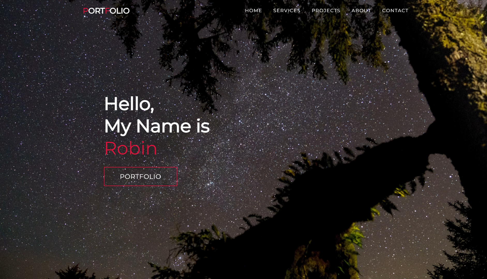

## Screenshot

## Skills
 

 

## Portfolio Website
- This is My Portfolio Website designed using HTML,CSS and Javascript.
- This website consists of all the project that I made.
- [Deployed link](http://robin-portfolio-six.vercel.app/)

## What I learned from this project
- I have learnt the importance of mobile responsive design from this project.

## Time taken
- It took me 8 hours to finish this project.6
